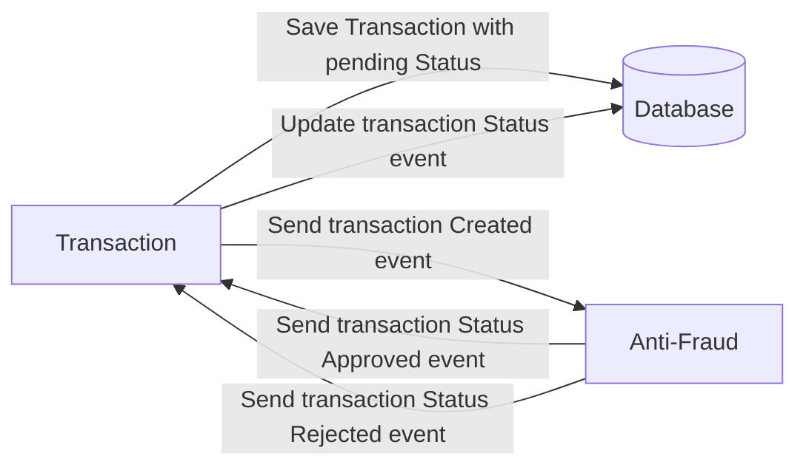

# Yape Code Challenge :rocket:

Our code challenge will let you marvel us with your Jedi coding skills :smile:.

Don't forget that the proper way to submit your work is to fork the repo and create a PR :wink: ... have fun !!

- [Problem](#problem)
- [Tech Stack](#tech_stack)
- [Send us your challenge](#send_us_your_challenge)

# Problem

Every time a financial transaction is created it must be validated by our anti-fraud microservice and then the same service sends a message back to update the transaction status.
For now, we have only three transaction statuses:

<ol>
  <li>pending</li>
  <li>approved</li>
  <li>rejected</li>  
</ol>

Every transaction with a value greater than 1000 should be rejected.



# Tech Stack

<ol>
  <li>Node. You can use any framework you want (i.e. Nestjs with an ORM like TypeOrm or Prisma) </li>
  <li>Any database</li>
  <li>Kafka</li>    
</ol>

We do provide a `Dockerfile` to help you get started with a dev environment.

You must have two resources:

1. Resource to create a transaction that must containt:

```json
{
  "accountExternalIdDebit": "Guid",
  "accountExternalIdCredit": "Guid",
  "tranferTypeId": 1,
  "value": 120
}
```

2. Resource to retrieve a transaction

```json
{
  "transactionExternalId": "Guid",
  "transactionType": {
    "name": ""
  },
  "transactionStatus": {
    "name": ""
  },
  "value": 120,
  "createdAt": "Date"
}
```

## Optional

You can use any approach to store transaction data but you should consider that we may deal with high volume scenarios where we have a huge amount of writes and reads for the same data at the same time. How would you tackle this requirement?

You can use Graphql;

# Send us your challenge

When you finish your challenge, after forking a repository, you **must** open a pull request to our repository. There are no limitations to the implementation, you can follow the programming paradigm, modularization, and style that you feel is the most appropriate solution.

If you have any questions, please let us know.

# Run this project

## Prerequisites

<a alt="Mise" href="https://mise.jdx.dev/" target="_blank" rel="noreferrer" style="font-size:3rem;">Mise</a>

✨ **The [node](https://nodejs.org/en), [pnpm](https://pnpm.io/es/) and [pulumi](https://www.pulumi.com/b/) versions for this project are managed with [mise.](https://mise.jdx.dev/)** ✨

### [Install mise](https://mise.jdx.dev/getting-started.html)

<br/><br/>

<a alt="Docker logo" href="https://www.docker.com/" target="_blank" rel="noreferrer"></a>

✨ **In this application, [docker](https://www.docker.com/) is used to manage [PostgreSQL](https://www.postgresql.org/), [Keycloak](https://www.keycloak.org/), [Redpanda](https://redpanda.com/) and [TiDB.](https://www.pingcap.com/)** ✨

## Install dependencies with [mise](https://mise.jdx.dev/)

To install node, pnpm and pulumi use the following syntax:

```zsh
mise install
```

## Create containers with [docker](https://www.docker.com/)

To create the necessary containers to run the application, use the following syntax:

```zsh
docker compose up -d
```

<!-- ## Create necessary data in keycloak to run the application

Go to the folder where the keycloak app is with the following syntax:

```zsh
cd apps/keycloak-iac/
```

Login in keycloak with the following syntax:

```zsh
pulumi login
```

Remove the `dev` stack with the following syntax:

```zsh
pulumi stack rm --force dev
```

Create the `dev` stack with the following syntax:

```zsh
pulumi stack init dev
```

Set environment variables for the keycloak provider with the following syntax:

```zsh
pulumi config set keycloak:url http://localhost:8080 && \
pulumi config set keycloak:clientId admin-cli --secret && \
pulumi config set keycloak:username admin && \
pulumi config set keycloak:password admin123 --secret
```

Create the resources in keycloak using the `dev` stack with the following syntax:

```zsh
pulumi up --stack dev
``` -->

## Management database:

Run the migrations using [prisma](https://www.prisma.io/) with the following syntax:

```zsh
pnpm prisma migrate reset --schema=apps/transaction/prisma/schema.prisma
```

## Run the application

### Start the service transaction

```sh
pnpm run start:dev transaction
```

### Start the service antifraud

```sh
pnpm run start:dev antifraud
```
